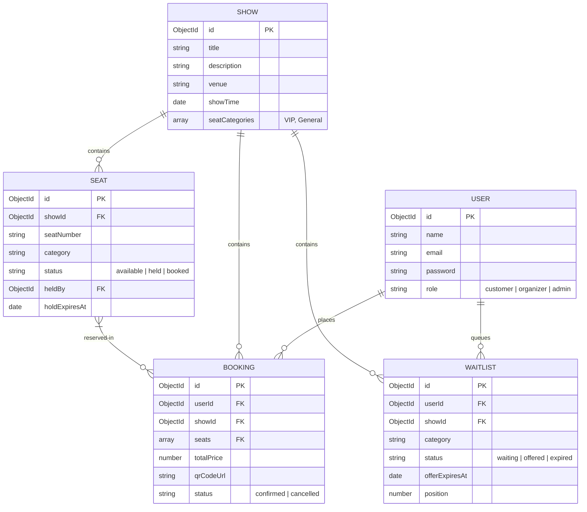

# Ticket Booking System

A high-performance MERN (MongoDB, Express, React, Node.js) stack ticket booking platform featuring real-time seat reservation holds, ACID transaction safety, Socket.io updates, FIFO waitlists, QR code confirmation tickets, and background TTL workers.

---

## Repository Structure
```
├── backend/
│   ├── models/        # Mongoose database schemas
│   ├── middleware/    # Auth and RBAC middleware
│   ├── routes/        # Express API endpoints
│   ├── utils/         # Sockets, Email dispatchers, and Waitlist processors
│   ├── workers/       # Background hold and offer expiration cron jobs
│   └── scripts/       # Database seeding & validation scripts
└── frontend/
    ├── src/
    │   ├── components/# UI views (SeatMap, WaitlistModal, AdminPanel)
    │   └── App.jsx    # Application shell, timers, and role states
    └── package.json
```

---

## Local Setup & Installation

### Prerequisites
- Node.js (v18+)
- MongoDB running locally on port `27017`

### 1. Database Initialization
Seed the database with sample users (Customer, Organizer, Admin) and an event show with a grid of 50 seats.
```bash
cd backend
npm install
npm run seed
```

### 2. Configure Environment Variables
Create `.env` file in the `backend/` directory (see `.env.example` below).
```bash
cp .env.example .env
```

### 3. Running Backend Services
Starts the Express server on port `5000` along with Socket.io and node-cron background hold workers.
```bash
npm run dev
```

### 4. Running Frontend Client
Start Vite development server on `http://localhost:5173`.
```bash
cd ../frontend
npm install
npm run dev
```

---

## Environment Configuration (.env.example)

```env
PORT=5000
MONGODB_URI=mongodb://127.0.0.1:27017/ticket-booking
JWT_SECRET=supersecretjwtkey12345!

# Optional SMTP Settings (defaults to mock Ethereal in development)
SMTP_HOST=
SMTP_PORT=
SMTP_USER=
SMTP_PASS=
SMTP_FROM=tickets@example.com
```

---

## Database Schemas (Mermaid Entity Relationship Diagram)



---

## Express API Reference

### 1. Authentication Endpoints
- `POST /api/auth/register`: Create a new user account.
- `POST /api/auth/login`: Authenticate email + password and return JWT.
- `GET /api/auth/me`: Retrieve currently logged-in profile data (Requires Bearer Token).

### 2. Seat Hold Endpoints
- `POST /api/seats/hold`: Hold one or more seats for 5 minutes (Requires Bearer Token).
- `GET /api/seats/shows`: Fetch all registered shows.
- `GET /api/seats/show/:showId`: Fetch seat status matrices for a specific show.
- `POST /api/seats/show`: Register a new show and auto-generate seat grids (Requires Admin/Organizer token).

### 3. Bookings Endpoints
- `POST /api/bookings/confirm`: Finalize holds into confirmed bookings, generate QR code, and send receipt (Requires Bearer Token).
- `POST /api/bookings/:id/cancel`: Cancel an active booking and trigger waitlist auto-assignment (Requires Owner or Admin Token).
- `GET /api/bookings/me`: Fetch active booking history for the current user (Requires Bearer Token).

### 4. Waitlist Endpoints
- `POST /api/waitlist/join`: Join queue positions for sold-out seat tiers (Requires Bearer Token).
- `POST /api/waitlist/claim`: Claim waitlist offers before the 5-minute TTL expires (Requires Bearer Token).
- `GET /api/waitlist/me`: Fetch waitlist history for the current user (Requires Bearer Token).
