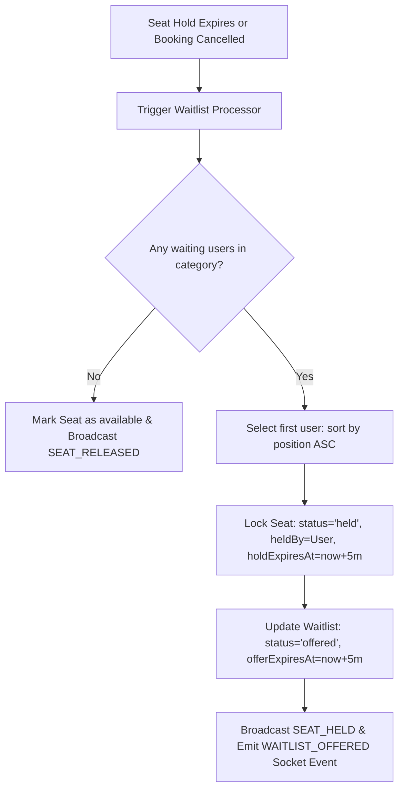

# System Design Write-Up: Ticket Booking Engine

This document details the architectural layout, concurrency patterns, queue pipelines, and deployment specifications for the high-concurrency ticket booking engine.

---

## 1. Seat Hold & TTL Expiration Mechanism

In a ticket booking platform, seat inventory is transiently reserved to allow customers to fill in credit card details without risking another user taking the seat mid-checkout. This is achieved via a stateful **Seat Hold** phase combined with a background Time-to-Live (TTL) auto-release loop.

### Lifecycle of a Hold:
1. **Initiation**: The customer selects available seats and dispatches a hold request. The server verifies seat availability and sets seat status to `held`, updates `heldBy` to the user's ID, and populates `holdExpiresAt` to `now + 5 minutes`.
2. **Checkout Grace Period**: The user has exactly 5 minutes to complete payment. During this period, the seat's state is yellow-coded (held by current user) or red-coded (held by other users).
3. **Expiration & Reversion**: If the checkout is not completed within 5 minutes, the seat must revert back to available.

### Background Worker Scheduling:
We avoid MongoDB's native TTL indexes for active seat holds. MongoDB's native TTL indexes run in background threads that only execute once every 60 seconds and do not guarantee immediate execution, causing a lag where seats remain locked long after holds expire. 

Instead, our design integrates a custom background cron worker powered by `node-cron` running every 15 seconds. The worker queries the database for:
```js
{ status: 'held', holdExpiresAt: { $lt: new Date() } }
```
For every expired seat hold found, the worker:
1. Reverts `status` to `available`, clearing `heldBy` and `holdExpiresAt`.
2. Emits a `SEAT_RELEASED` real-time event via Socket.io.
3. Chains the **Waitlist Processor** to see if any users are queued for that seat category.

---

## 2. Concurrency Prevention & Database Safety

Race conditions are inevitable when thousands of users click "Book Now" for the same seat at the exact same millisecond. To guarantee that a seat cannot be double-booked, we implement a multi-layered concurrency prevention strategy.

### MongoDB ACID Transactions:
Using Mongoose sessions (`mongoose.startSession()`), the server initializes a database transaction.
- **Read & Lock**: Within the transaction, the server queries for seats matching the requested IDs where `status` is strictly `'available'`. If the count of returned seats does not match the requested count, the transaction is aborted immediately.
- **Atomic Modification**: An `updateMany` operation is issued inside the transaction context to update status to `'held'`.
- **Commit**: If no conflict occurs, the session is committed. In high-concurrency production replica sets, this guarantees absolute isolation.

### Standalone Fallback & Atomic Conditional Updates:
Transactions are only supported on MongoDB replica sets. To make local development on standalone MongoDB servers seamless without compromising concurrency security, the engine implements a fallback utilizing atomic conditional updates (`findOneAndUpdate` and query-scoped `updateMany`).

The query filter itself contains the state assertions:
```js
const result = await Seat.updateMany(
  { _id: { $in: seatIds }, showId, status: 'available' },
  { $set: { status: 'held', heldBy: userId, holdExpiresAt } }
);
```
MongoDB guarantees document-level atomic locks. If two parallel requests attempt to hold the same seat, MongoDB serialize the writes. The first request modifies the document, changing `status` to `'held'`. The second request's query filter `{ status: 'available' }` no longer matches, resulting in a `modifiedCount` of `0`. The application detects this delta, rolls back any partial updates, and safely rejects the concurrent request with a `409 Conflict` status.

---

## 3. Waitlist FIFO & Time-Limited Offers

When high-demand shows sell out specific categories (like VIP), users can register on a FIFO (First-In, First-Out) waitlist. Rather than letting users poll for cancellations, the system implements an active **Auto-Assignment Pipeline**.

### FIFO Queuing:
When joining, the system counts the active waitlisted users for the show and category to calculate the current queue position:
```js
const position = await Waitlist.countDocuments({ showId, category, status: 'waiting' }) + 1;
```
Entries are saved with `status: 'waiting'`.

### Auto-Assignment Pipeline:
The waitlist pipeline is triggered automatically by two events:
1. A confirmed booking is cancelled via `POST /api/bookings/:id/cancel`.
2. An active seat hold expires via the background cron worker.



### Claiming & Expirations:
- **Claim**: The offered user can call `POST /api/waitlist/claim`. The endpoint verifies the offer has not expired, creates a confirmed `Booking`, registers the QR code, and updates waitlist status to `expired` (completed).
- **Expiration**: If the user fails to claim the offer within 5 minutes, the background cron worker catches the expired offer. It updates the waitlist entry status to `expired`, and immediately runs `processWaitlistQueue` again, passing the seat to the next waitlist candidate in FIFO order.

---

## 4. Production Deployment Plan

To scale this platform, we deploy services separately to optimize resource use and handle web socket connections efficiently.

```
                  ┌───────────────────┐
                  │   Vercel (CDN)    │
                  │   React Frontend  │
                  └─────────┬─────────┘
                            │ HTTPS & WSS
                            ▼
                  ┌───────────────────┐
                  │    Render / ECS   │
                  │    Express API    │
                  └─────────┬─────────┘
                            │
            ┌───────────────┴───────────────┐
            ▼                               ▼
 ┌─────────────────────┐         ┌─────────────────────┐
 │    MongoDB Atlas    │         │    Render Cron /    │
 │ (Replica Set Cluster)│        │  Background Worker  │
 └─────────────────────┘         └─────────────────────┘
```

### 1. Frontend: Vercel
- **Asset hosting**: The React + Vite production build is deployed to Vercel's global Edge Network for fast delivery.
- **Routing fallback**: Configured with a `vercel.json` file pointing all routing to `index.html` to support client-side routing.

### 2. Backend API & WebSockets: Render / AWS ECS
- **WebSockets Support**: Standard serverless functions (like Vercel Serverless) do not support persistent TCP connections required by Socket.io. We deploy the Express server on Render (Web Service instance type) or AWS ECS, which run persistent containers.
- **CORS Configuration**: Allowed origins are restricted to the production frontend domain.

### 3. Database Layer: MongoDB Atlas
- **Replica Sets**: We host the database on MongoDB Atlas (M10+ tier). This ensures full native support for ACID Transactions and automatic horizontal scaling.
- **Indexing**: Compound indices are built on `{ showId: 1, seatNumber: 1 }` and `{ showId: 1, category: 1, userId: 1 }` to guarantee query performance.
